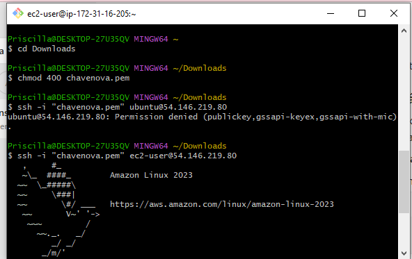
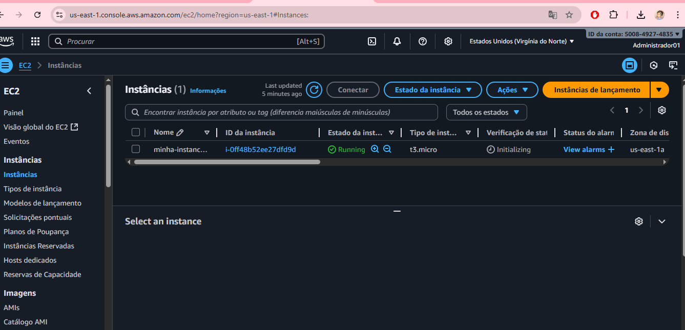
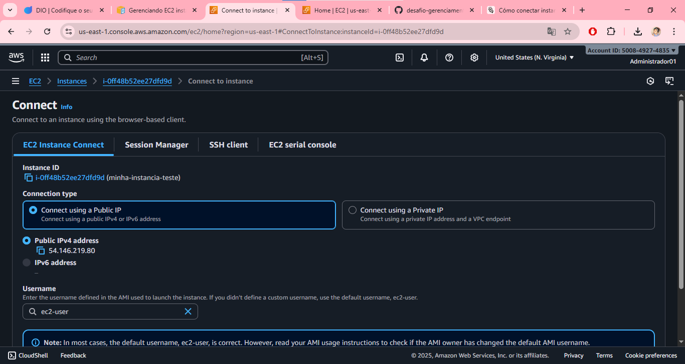
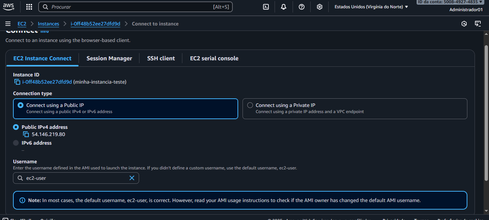
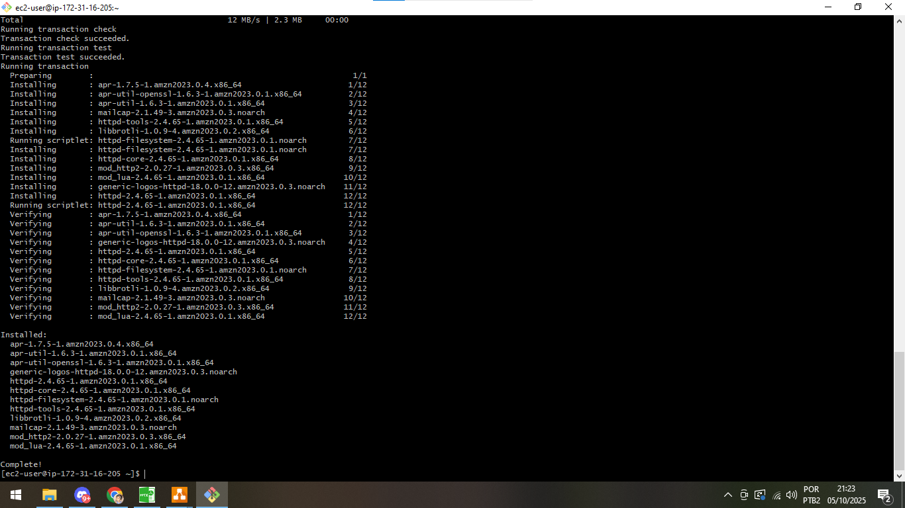

# 🚀 Desafio - Gerenciamento de Instâncias EC2 na AWS

Este repositório foi criado como parte do desafio da **DIO** para consolidar conhecimentos em **gerenciamento de instâncias EC2 na AWS**.  
Aqui você encontra prints das etapas realizadas e anotações do processo.

---

## 🎯 Objetivos de Aprendizagem
- Aplicar conceitos de instâncias EC2 em um ambiente prático.  
- Documentar processos técnicos de forma clara e estruturada.  
- Utilizar o GitHub para compartilhar documentação técnica.  

---

## 🛠️ Tecnologias Utilizadas
- **AWS EC2**
- **Git e GitHub**

---

## 📸 Prints do Desafio

Abaixo alguns registros do processo realizado no console da AWS:

  
  
  

---

## 📌 Observações
Este repositório contém apenas prints como evidência do desafio.

---

## ✨ Autora
Feito com 💻 por **Priscilla Malta**
